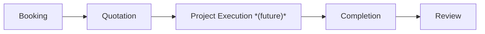
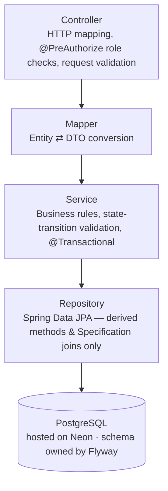
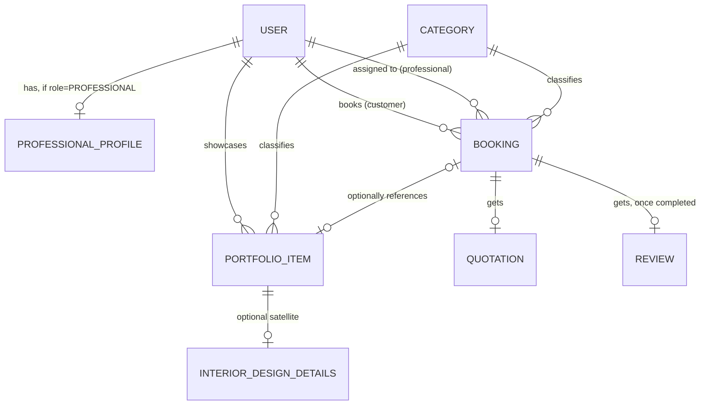

<div align="center">

# 🏠 Velora Backend

**One platform for every home service — from a full interior-design transformation to a single plumbing fix.**

[](https://openjdk.org/projects/jdk/21/)
[](https://spring.io/projects/spring-boot)
[](https://neon.tech)
[](https://flywaydb.org/)
[](https://jwt.io/)
[](https://maven.apache.org/)
[]()

[Quick Start](#-quick-start) • [API Reference](#-api-reference) • [Architecture](#-architecture) • [Domain Model](#-domain-model) • [Design Notes](#-design-notes--extensibility)

</div>

---

## 📖 Overview

Velora supports two customer journeys — **Full Home Services** (a designer-led,
end-to-end interior-design project) and **Individual Services** (a standalone trade
job: painting, plumbing, electrical, carpentry, false ceiling, modular kitchen). Both
share the same account type (`PROFESSIONAL`), the same portfolio model, and the same
booking lifecycle.

Velora is **admin-controlled assignment, not a marketplace** — a customer never
browses, searches, or picks a professional directly. Every booking starts awaiting
assignment; an admin gets a ranked, scored list of candidate professionals
(specialization, portfolio, experience, location, rating, budget fit) and assigns the
pick. The journey looks like:



> 📄 Full scope beyond what's built so far — project execution/scheduling, milestones,
> payments, material procurement — is tracked as later phases. See
> [`IMPLEMENTATION_FLOW.md`](./IMPLEMENTATION_FLOW.md) for exactly what's built vs. not,
> and [`Velora-Whitepaper.html`](./docs/Velora-Whitepaper.html)
> for the full product + architecture writeup (open in a browser, print-to-PDF for a
> shareable document).

## 📱 Frontends

This repo is the **one shared backend** behind three separate frontend apps — one
API, one JWT auth model, one Postgres database, role-scoped by `CUSTOMER`/
`PROFESSIONAL`/`ADMIN`. No per-app backend, API, auth, or database split: see
[Design Notes](#-design-notes--extensibility) for why a modular monolith is the right
call at Velora's current scale.

| App | Repo | Role |
|---|---|---|
| Customer app | `velora-frontend` | `CUSTOMER` |
| Professional app | [`velora-professional-app`](https://github.com/nits2733/velora-professional-app) | `PROFESSIONAL` |
| Admin dashboard | [`velora-admin-dashboard`](https://github.com/nits2733/velora-admin-dashboard) | `ADMIN` |

## 🧰 Tech Stack

| | |
|---|---|
| **Language / Runtime** | Java 21 |
| **Framework** | Spring Boot 3.3 |
| **Security** | Spring Security + JWT (jjwt) — stateless auth, 3 roles: `CUSTOMER`, `PROFESSIONAL`, `ADMIN` |
| **Persistence** | Spring Data JPA + PostgreSQL, hosted on [Neon](https://neon.tech) — no local DB server needed |
| **Migrations** | Flyway — schema owned entirely by version-controlled `.sql` files |
| **Docs** | springdoc-openapi (Swagger UI) |
| **Config** | spring-dotenv — auto-loads `.env` at startup |
| **Build** | Maven |

## 🚀 Quick Start

<table>
<tr><td width="32px" align="center"><b>1</b></td><td>

**Get a Postgres connection.** This project runs against a cloud-hosted **Neon**
instance — no local DB server or Docker required. Create a free project at
[neon.tech](https://neon.tech) (or point at any Postgres 14+ instance you already have)
and grab its connection string.

</td></tr>
<tr><td align="center"><b>2</b></td><td>

**Configure environment.** Copy `.env.example` to `.env` and fill in your real values:

```bash
cp .env.example .env
```

At minimum set:
| Variable | Purpose |
|---|---|
| `DB_URL` | e.g. `jdbc:postgresql://<your-neon-host>/<dbname>?sslmode=require` |
| `DB_USERNAME` / `DB_PASSWORD` | From your Postgres provider |
| `JWT_SECRET` | 32+ bytes; generate with `openssl rand -base64 48` |
| `BREVO_EMAIL` | Your Brevo (Sendinblue) account email |
| `BREVO_SMTP_KEY` | SMTP key generated from Brevo Dashboard (Settings → SMTP & API) |
| `CLOUDINARY_URL` | Cloudinary asset management connection string |

> 📧 **Brevo SMTP Setup (Email OTP & 2FA)**:
> 1. Sign up at [brevo.com](https://brevo.com) (Free plan includes 300 emails/day, no domain verification required for testing).
> 2. Navigate to **Settings → SMTP & API → SMTP tab → Generate SMTP Key**.
> 3. Set `BREVO_EMAIL` to your login email and `BREVO_SMTP_KEY` to the generated key (NOT your account password).
> 4. For production, verify your sending domain in the Brevo dashboard to avoid spam filters.
> 5. HTTPS is mandatory in production to protect credentials and OTP transmission.

> ⚠️ The app **fails fast at startup** if `JWT_SECRET` is missing or too short — this
> is intentional, it must never default silently in a real deployment. `.env` is
> gitignored and loaded automatically via `spring-dotenv`; nothing to `export` manually.

</td></tr>
<tr><td align="center"><b>3</b></td><td>

**Run it.**

```bash
mvn spring-boot:run
```

Or, for local development conveniences (a safe placeholder JWT secret so you don't
have to generate one immediately, plus verbose SQL logging):

```bash
mvn spring-boot:run -Dspring-boot.run.profiles=local
```

Flyway applies every migration in `src/main/resources/db/migration/` automatically on
startup, in order (`V1` through the latest — see [Database Migrations](#-database-migrations)).

</td></tr>
<tr><td align="center"><b>4</b></td><td>

**Explore the API.**

| Resource | URL |
|---|---|
| 📘 Swagger UI | http://localhost:8080/swagger-ui/index.html |
| 📄 OpenAPI JSON | http://localhost:8080/v3/api-docs |
| ❤️ Health check | http://localhost:8080/actuator/health |

</td></tr>
<tr><td align="center"><b>5</b></td><td>

**Log in as a seeded account** — no need to register anything to start exploring:

| Account | Email | Password | Role |
|---|---|---|---|
| Demo professional | `designer@velora.com` | `Designer@123` | `PROFESSIONAL` |
| Bootstrap admin | `admin@velora.com` | `Admin@123` | `ADMIN` |

<details>
<summary>Why the demo account's email still says "designer"</summary>
<br>

Its email/password were seeded before the `DESIGNER`→`PROFESSIONAL` rename — only its
`role` column changed, not its login credentials.
</details>

There's no self-registration path for admin accounts (`AuthService.register` blocks it
unconditionally) — the seeded account above is currently the only way to reach any
`/api/bookings/{id}/assign` or `/recommendations` endpoint.

</td></tr>
</table>

## ✅ Running Tests

```bash
mvn test
```

<details>
<summary><b>What's covered</b></summary>
<br>

**Service tests** (JUnit 5 + Mockito + AssertJ) cover the business rules: JWT
issuance/validation, auth registration rules (duplicate email, admin self-registration
blocked, professional profile auto-creation), booking creation/state-transition/ownership
rules (including the Full Home Services vs. Individual Service split and the
assignment-request path), quotation draft/send/accept/reject rules,
professional-matching scoring/ranking/tie-breaking, portfolio-item
upload/edit/delete rules, the professional directory, and review
creation/duplicate-prevention/rating recomputation.

**Web-layer tests** (`@WebMvcTest` + MockMvc + spring-security-test) cover what services
can't see, running against the *real* security chain — actual `SecurityConfig` rules,
actual JWT filter, actual `RestSecurityErrorHandler`:

- which endpoints are genuinely public vs. token-required
- `@PreAuthorize` role guards per endpoint (customer-only, professional-only, admin-only)
- the error contract on the wire: 401/403/404/409/400 bodies all in one `ApiErrorResponse` shape
- bean validation running before any service is reached, reporting every bad field at once
- controller-only logic: page-size clamping, sort-field whitelisting, principal-id plumbing

There is still no test against a real Postgres instance in this environment — repository
queries and migrations are unexercised, so verify against your Neon instance with
`mvn spring-boot:run` before deploying.
</details>

## 🧩 Module Overview

| Module | Responsibility |
|---|---|
| 🔐 Auth | Register (customer/professional only), login, JWT issuance, password hashing (BCrypt) |
| 👤 User | Get/update own profile — customer, or professional (bio/specialization/city/availability/rating) |
| 🧑‍🔧 Professional (admin only) | Directory search, single-profile lookup by id, reviews — used by admin for assignment, never customer-facing |
| 🖼️ Portfolio | Categories (public); work-sample catalog search/detail (admin only, for assignment context); upload/edit/delete (professional, own items only) |
| 📅 Booking | Book a Full Home Services project or an Individual Service request — always starts awaiting Velora assignment, the customer never names a professional |
| 🎯 Professional Matching | Admin-only: rank candidate professionals for an assignment-requested booking |
| 💰 Quotation | Post-consultation itemized estimate: draft → send → customer accepts/rejects |
| ⭐ Review | One rating (1–5) + comment per completed booking; recomputes the professional's aggregate rating |

<details>
<summary><b>Explicitly out of scope so far</b></summary>
<br>

Project execution/scheduling, milestones, payments (Razorpay), notifications
(Firebase), Cloudinary image upload (portfolio items accept an image *URL* today, not
a file), Google Maps, refresh tokens, OTP, password reset, and a real
professional-availability calendar (today it's a simple self-toggled flag). Customer
browsing/searching/selecting a professional is intentionally **not** a feature — see
[Design Notes](#-design-notes--extensibility).
</details>

## 🏗️ Architecture



DTOs never expose entities directly; every request flows the same direction, no layer
is ever skipped. **Zero `@Query`/native SQL anywhere** — everything goes through
Spring Data derived query methods or `Specification` joins.

## 🗺️ Domain Model



`PortfolioItem` is generic across every trade; `InteriorDesignDetails` is an optional
1-to-1 satellite carrying `styleTag`/`priceEstimate` — populated only for interior-design
work, so a painter's or plumber's item simply has no row there. See
[Design Notes](#-design-notes--extensibility) for why.

## 📡 API Reference

All endpoints are prefixed `/api`. Protected endpoints require
`Authorization: Bearer <token>`.

<details open>
<summary><b>🔐 Auth &amp; sessions</b></summary>

| Method | Path | Auth | Description |
|---|---|---|---|
| POST | `/auth/register` | public | Register as CUSTOMER or PROFESSIONAL (ADMIN is rejected) → access + refresh token |
| POST | `/auth/login` | public | Login → access + refresh token |
| POST | `/auth/refresh` | public¹ | Exchange a refresh token for a **new pair** — the presented token is revoked (rotation) |
| POST | `/auth/logout` | public¹ | End this session. Idempotent — an unknown or already-revoked token still returns `204` |
| POST | `/auth/logout-all` | **token** | End every session for the current user |
| POST | `/auth/password/forgot` | public | Request a reset token. Always `202`, even for unknown emails (no account enumeration) |
| POST | `/auth/password/reset` | public¹ | Set a new password with a reset token. Single-use; revokes all sessions |
| POST | `/auth/password/change` | **token** | Change your own password (current password required); revokes all sessions |

¹ No `Authorization` header needed — the refresh/reset token in the body *is* the credential.

**Token model:** the access token is a short-lived (15 min default) JWT and cannot be
revoked; the refresh token is long-lived (30 days), opaque, stored only as a SHA-256
digest, and revocable. Clients keep both, call `/auth/refresh` on a `401`, and re-login
only if that fails too.
</details>

<details>
<summary><b>👤 User (authenticated)</b></summary>

| Method | Path | Description |
|---|---|---|
| GET | `/users/profile` | Get own profile (includes professional profile section if PROFESSIONAL) |
| PUT | `/users/profile` | Update own profile (partial update, incl. availability toggle) |
</details>

<details>
<summary><b>🧑‍🔧 Professionals (admin only)</b></summary>

Customers never browse or select a professional — these exist so an admin can review
candidates while assigning a booking.

| Method | Path | Role | Description |
|---|---|---|---|
| GET | `/professionals?search=&specialization=&city=&availability=&minExperience=&minRating=&page=&size=&sortBy=&direction=` | ADMIN | Searchable directory — paginated cards, highest-rated first by default; `minRating` excludes unrated professionals |
| GET | `/professionals/{id}` | ADMIN | Get one professional's profile (adds the bio) |
| GET | `/professionals/{id}/reviews?page=&size=` | ADMIN | That professional's reviews, newest first — rating, comment, reviewer name (no booking id) |
</details>

<details open>
<summary><b>🖼️ Portfolio Catalog</b></summary>

| Method | Path | Role | Description |
|---|---|---|---|
| GET | `/categories` | public | List all categories (each tagged HOME_PROJECT or INDIVIDUAL_SERVICE) |
| GET | `/portfolio?category=&search=&style=&page=&size=&sortBy=&direction=` | ADMIN | Paginated/filterable portfolio catalog — admin assignment context, not customer browsing |
| GET | `/portfolio/{id}` | ADMIN | Portfolio item detail |
| POST | `/portfolio` | PROFESSIONAL | Upload a new portfolio item under the caller's own account; `styleTag`/`priceEstimate` are optional — supplying either creates the item's `InteriorDesignDetails` satellite, omitting both leaves it a plain generic item |
| PUT | `/portfolio/{id}` | PROFESSIONAL (owner) | Replace one of your own items — full replacement, not a patch; omitting both `styleTag` and `priceEstimate` drops an existing `InteriorDesignDetails` satellite |
| DELETE | `/portfolio/{id}` | PROFESSIONAL (owner) | Delete one of your own items → `204`; refused with `409` while any booking still references it |
</details>

<details open>
<summary><b>📅 Bookings (authenticated)</b></summary>

| Method | Path | Role | Description |
|---|---|---|---|
| POST | `/bookings` | CUSTOMER | Create a booking — `requestType` FULL_HOME_PROJECT or INDIVIDUAL_SERVICE; always starts `PENDING_ASSIGNMENT`, Velora (an admin) always assigns the professional |
| GET | `/bookings?page=&size=` | any | Own bookings (customer: booked; professional: assigned) |
| GET | `/bookings/{id}` | participant | Booking detail |
| PATCH | `/bookings/{id}/cancel` | CUSTOMER (owner) | Cancel a PENDING_ASSIGNMENT/PENDING/CONFIRMED booking |
| PATCH | `/bookings/{id}/status` | PROFESSIONAL (assigned) | PENDING→CONFIRMED/CANCELLED, CONFIRMED→COMPLETED/CANCELLED |
| GET | `/bookings/awaiting-assignment?page=&size=` | ADMIN | Admin work queue — bookings still awaiting a professional, oldest first |
| GET | `/bookings/{id}/recommendations` | ADMIN | Ranked candidate professionals for a booking awaiting assignment |
| PATCH | `/bookings/{id}/assign` | ADMIN | Assign a professional to a booking awaiting assignment |
</details>

<details>
<summary><b>💰 Quotations (authenticated, nested under a booking)</b></summary>

| Method | Path | Role | Description |
|---|---|---|---|
| PUT | `/bookings/{bookingId}/quotation` | PROFESSIONAL (assigned) | Create/replace a draft quotation |
| POST | `/bookings/{bookingId}/quotation/send` | PROFESSIONAL (assigned) | Send the draft to the customer |
| GET | `/bookings/{bookingId}/quotation` | participant | Get the quotation |
| PATCH | `/bookings/{bookingId}/quotation/accept` | CUSTOMER (owner) | Accept a sent quotation |
| PATCH | `/bookings/{bookingId}/quotation/reject` | CUSTOMER (owner) | Reject a sent quotation |
</details>

<details>
<summary><b>⭐ Reviews (authenticated, nested under a booking)</b></summary>

| Method | Path | Role | Description |
|---|---|---|---|
| POST | `/bookings/{bookingId}/review` | CUSTOMER (owner) | Leave a 1–5 rating + comment (only once, only after COMPLETED) |
</details>

## ⚙️ Environment Variables

See `.env.example` for the full list: `DB_URL`, `DB_USERNAME`, `DB_PASSWORD`,
`DB_POOL_SIZE`, `JWT_SECRET` (required, 32+ bytes), `JWT_EXPIRATION_MS` (access token,
default 15m), `REFRESH_TOKEN_TTL` (default `30d`), `PASSWORD_RESET_TTL` (default `30m`),
`CORS_ALLOWED_ORIGINS`, `PORT`.

> ⚠️ **Password reset delivery is not wired up.** `PasswordResetNotifier` currently has
> one implementation, `LoggingPasswordResetNotifier`, which writes the reset token to the
> application log so the flow is usable in development. Before production, add a bean that
> emails it — everything else about the flow (hashing, expiry, single use, session
> revocation) is already in place and won't change.

## 🧬 Database Migrations

`ddl-auto: validate` — the schema is owned entirely by Flyway migrations in
`src/main/resources/db/migration/`, never by Hibernate auto-DDL. Migrations already
applied are **never edited** — every change, including fixing a mistake in a previous
migration, is a new `V{n}__description.sql` file.

| # | Migration | What it does |
|---|---|---|
| V1 | `init_schema.sql` | Creates `users`, `designer_profiles`, `categories`, `designs`, `bookings` (original names, since renamed — see V7/V8) |
| V2 | `seed_data.sql` | Seeds categories, a demo designer account + profile, sample designs |
| V3 | `quotations.sql` | Adds `quotations` + `quotation_line_items` |
| V4 | `admin_and_designer_assignment.sql` | Adds `ADMIN` role, makes `bookings.designer_id` nullable, adds `PENDING_ASSIGNMENT` status, seeds a bootstrap admin account |
| V5 | `ratings_and_availability.sql` | Adds `reviews`; adds availability/rating columns to `designer_profiles`; adds category/style/budget/location columns to `bookings` for matching |
| V6 | `widen_review_rating_column.sql` | Fixes a `SMALLINT`/`INTEGER` column-type mismatch found in V5 at first boot |
| V7 | `rename_designer_to_professional_and_add_request_types.sql` | Renames role `DESIGNER`→`PROFESSIONAL`, `designer_profiles`→`professional_profiles`, every `designer_id` column→`professional_id`; adds `bookings.request_type` and `categories.service_group`; seeds the six Individual Service trade categories |
| V8 | `generalize_design_to_portfolio_item.sql` | Renames `designs`→`portfolio_items`, `bookings.design_id`→`portfolio_item_id`; splits `style_tag`/`price_estimate` into a new optional `interior_design_details` satellite table |

## 💡 Design Notes / Extensibility

> **`PortfolioItem` + optional `InteriorDesignDetails`, not one flat table.**
> A work sample is generic across every trade (`title`, `description`, `category`,
> `coverImageUrl`) — a painter's before/after photo and an interior designer's concept
> board are the same shape at that level. Only interior design work has a structured
> `styleTag`/`priceEstimate` worth filtering and sorting on, so those two fields live
> in a separate, optional 1-to-1 `InteriorDesignDetails` row instead of on
> `PortfolioItem` itself. This mirrors the same shape already used for `User` +
> optional `ProfessionalProfile`, rather than introducing a generic JSON metadata blob
> (which would break this codebase's zero-`@Query`, fully-typed-and-filterable
> convention) or JPA inheritance (more complexity than the domain currently needs).

- A professional can upload their own portfolio items (`POST /portfolio`) — but
  there's still no update/delete endpoint yet, so a mis-entered item can't be
  corrected or removed via the API today.
- Portfolio images are plain URL strings (`cover_image_url`) for now — swap for a
  Cloudinary-backed upload flow later without changing `PortfolioItem`'s public shape.
- Portfolio items are never directly purchasable — a booking only optionally
  *references* one for context; the priced artifact is always the `Quotation` created
  after a consultation, never the catalog entry itself.
- Professional "availability" is a self-managed on/off flag today, not a real
  scheduling calendar — `ProfessionalMatchingService` just filters on it. A future
  calendar can replace the stored flag with a computed one without changing how
  matching consumes it.
- **Roadmap idea — supervisor role for Full Home Project execution.** Today a Full
  Home Project has one professional end to end. Once project execution/milestones are
  built, execution should hand off to a dedicated **supervisor** — separate from the
  designer who owns the creative/consultation side — who coordinates the trade
  professionals on site and is the customer's point of contact during execution. Same
  person can play both roles, but modeling them separately lets a designer's projects
  draw from a shared pool of supervisors. Likely shape: an optional
  `Booking.supervisor` reference (still a `PROFESSIONAL`, not a new role) assigned once
  the booking reaches `CONFIRMED`.

**Professional matching score — deterministic, out of 100:**

| Factor | Points |
|---|---:|
| Specialization / category match | 30 |
| Portfolio evidence (category 10 + style 10) | 20 |
| Experience (capped at 10 years) | 15 |
| Location match | 15 |
| Rating (unrated professionals get a neutral 3.0/5, not zero) | 15 |
| Budget fit | 5 |

No ML, no external scoring service — and it always produces a **ranked list an admin
confirms**, never a silent auto-assignment.

- JWT is access-token-only (no refresh token) — expiry is deliberately
  short-lived-friendly via `JWT_EXPIRATION_MS`; refresh-token rotation is a later phase.
- All list endpoints are paginated (`page`, `size`, capped at 50) from day one to avoid
  an unpaginated endpoint becoming a breaking change later.

---

<div align="center">

📄 [`IMPLEMENTATION_FLOW.md`](./IMPLEMENTATION_FLOW.md) — full code-level walkthrough of every layer
&nbsp;•&nbsp;
🧭 [Flow diagrams](./IMPLEMENTATION_FLOW.md#27-appendix-end-to-end-flow-diagrams-no-code) — every request flow as a no-code decision tree
&nbsp;•&nbsp;
📘 [`Velora-Whitepaper.html`](./docs/Velora-Whitepaper.html) — product + architecture whitepaper (print-to-PDF)
&nbsp;•&nbsp;
🔌 [`Velora-ThirdParty-Setup.pdf`](./docs/Velora-ThirdParty-Setup.pdf) — third-party services to set up, and how

</div>
